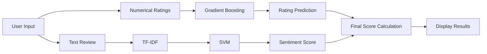

# 🌟 Hotel Rating & Sentiment Analysis System

A **hybrid machine learning system** that predicts hotel ratings (1-10) by analyzing both **numerical inputs** (cleanliness, service, comfort, amenities) and **text reviews** through sentiment analysis. The system blends **regression** and **classification** models to provide an accurate, explainable final score.

---

## 🚀 Project Overview

This project integrates **structured rating data** with **natural language processing (NLP)** to generate a blended hotel rating using machine learning techniques.

### ✅ Key Features

- **Hybrid Prediction Model**  
  - 🎯 Gradient Boosting Regressor for numerical rating prediction  
  - 💬 SVM / Logistic Regression for text sentiment classification  
  - 🧠 TF-IDF Vectorization for review text analysis  

- **Smart Scoring Formula**  
  - 60% → Numerical ratings  
  - 40% → Sentiment analysis  
  - 🧪 Enhanced with NLTK's VADER for better sentiment detection  

- **User-Friendly Web Interface**  
  - Simple form input for both ratings and review  
  - Instant prediction with visual feedback  

- **Robust Error Handling**  
  - Ratings clamped to valid range (1–10)  
  - User guidance on incorrect or empty inputs  

---

## 🧠 Technical Components

### 1. Machine Learning Models

| Model | Algorithm | Purpose |
|-------|-----------|---------|
| Rating Predictor | Gradient Boosting Regressor | Predicts score from numerical inputs |
| Sentiment Analyzer | SVM + TF-IDF | Classifies review sentiment (Positive/Negative) |
| Score Blender | Custom Formula | Blends numerical and sentiment scores |

### 2. Data Flow Diagram



### 3. Key Improvements Over Baseline

- ✅ Added synthetic examples to better model perfect scores (10/10)
- 🧠 Phrase-aware sentiment using n-grams & SVM + Vader
- ⚖️ Balanced scoring formula to avoid underestimation

---

## 🛠️ How It Works

1. **User Input**
   - Cleanliness, Service, Comfort, Amenities (1–10)
   - Free-text Review

2. **Prediction Pipeline**
   - Ratings → Gradient Boosting → Numerical Score  
   - Review → TF-IDF + SVM → Sentiment %  
   - Final Score = (0.6 × Numerical) + (0.4 × Sentiment-Based Rating)

3. **Output**
   - 🔢 Predicted Rating (e.g. 8.7/10)
   - 😊 Sentiment (e.g. 94% Positive)
   - ⭐ Final Blended Score (e.g. 8.9/10)

---

## 💼 Applications

- 🏨 **Hotel Management**  
  Improve services by analyzing predicted scores from user feedback  

- 📊 **Review Platforms**  
  Standardize reviews and identify suspicious content  

- 📈 **Quality Monitoring**  
  Track trends and improve customer satisfaction over time  

---

## 💻 Try It Out

### 1. Installation

```bash
pip install flask pandas scikit-learn nltk
python -m nltk.downloader vader_lexicon
```

### 2. Run the Application

```bash
python app.py
```

Open in browser: [http://localhost:5000](http://localhost:5000)

### 3. Sample Input

- Cleanliness: 9  
- Service: 8  
- Comfort: 9  
- Amenities: 7  
- Review: *"Loved the comfortable beds and friendly staff!"*

### 🔍 Output:

- Rating Prediction: **8.7/10**  
- Sentiment: **94% Positive**  
- Final Score: **8.9/10**

---

## 📁 File Structure

```
.
├── app.py
├── model_utils.py
├── templates/
│   └── index.html
└── static/
    └── style.css
```
